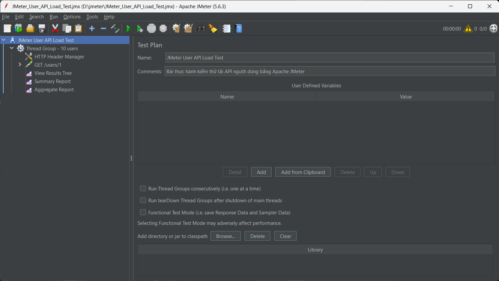
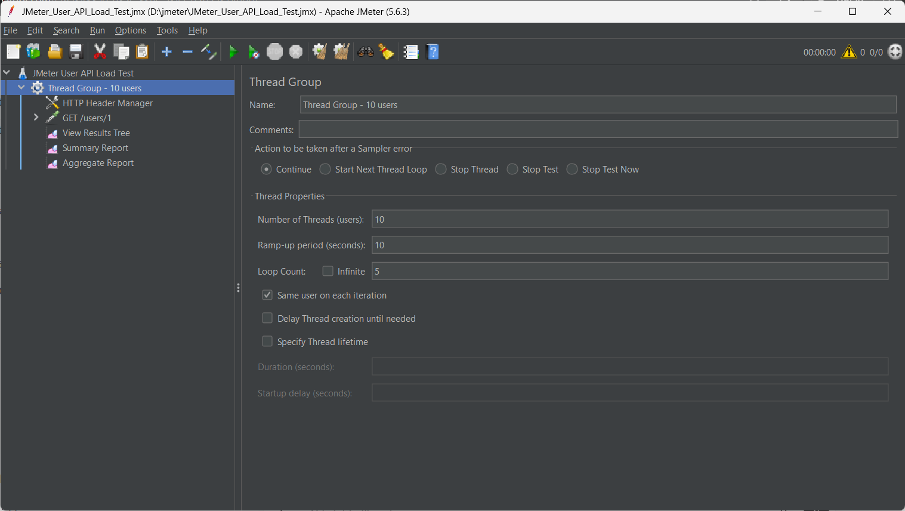
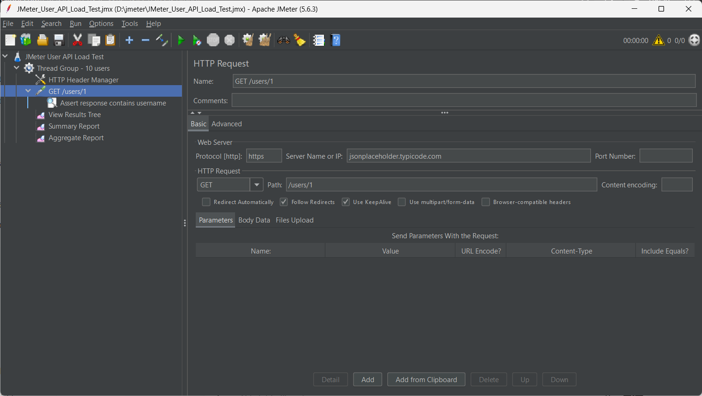
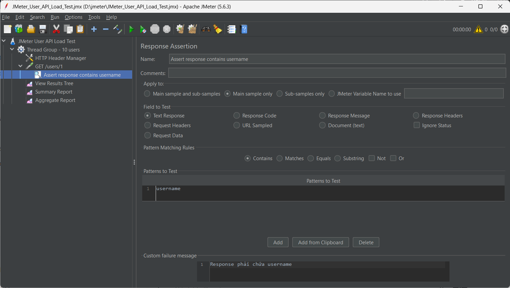
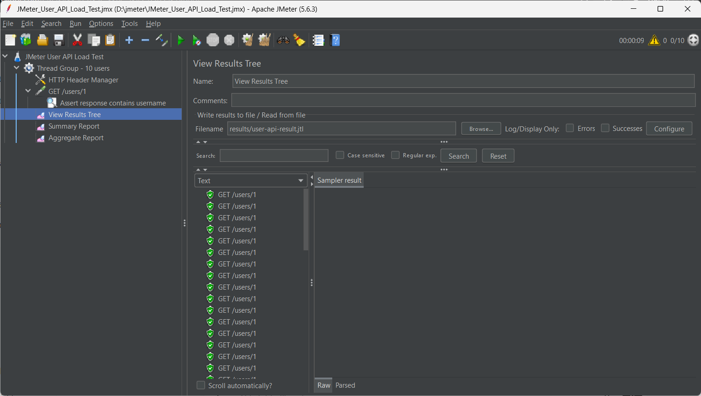
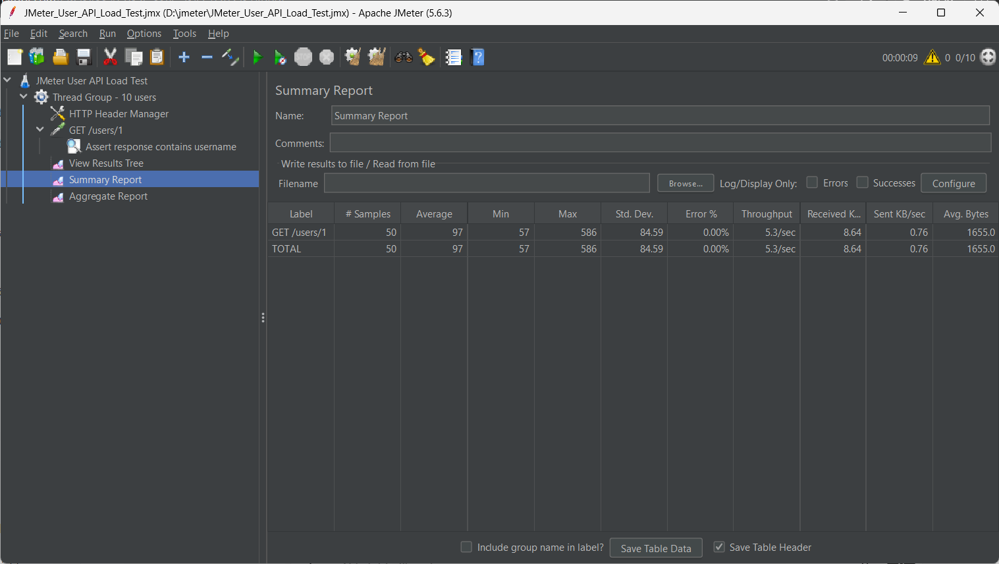
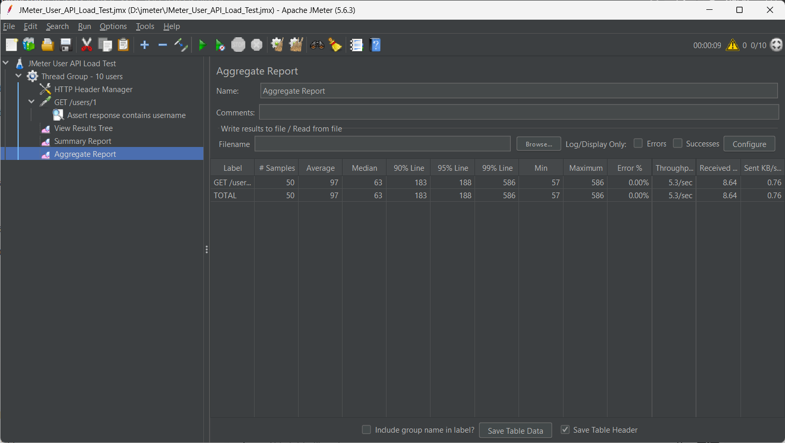

# Báo cáo thực hành kiểm thử JMeter - User API Load Test

## 1. Thông tin sinh viên

- Họ và tên: Nguyễn Văn Thăng
- Mã sinh viên: 23010572
- Công cụ thực hành: Apache JMeter

## 2. Mục tiêu thực hành

Bài thực hành này được thực hiện để tìm hiểu cách dùng Apache JMeter trong kiểm thử API và kiểm thử tải cơ bản. Nội dung chính gồm tạo Test Plan, cấu hình Thread Group, gửi HTTP Request, kiểm tra dữ liệu phản hồi bằng Response Assertion và xem kết quả qua các Listener.

## 3. API được kiểm thử

Trong bài này, em sử dụng API mẫu của JSONPlaceholder.

| Thành phần | Nội dung |
|---|---|
| Method | GET |
| Protocol | HTTPS |
| Server | jsonplaceholder.typicode.com |
| Path | /users/1 |
| Mục tiêu kiểm tra | Response phải chứa chuỗi `username` |

URL đầy đủ:

```text
https://jsonplaceholder.typicode.com/users/1
```

## 4. Cấu hình kịch bản kiểm thử

Thread Group được cấu hình để mô phỏng nhiều người dùng gửi request đến API.

| Thành phần | Giá trị |
|---|---:|
| Number of Threads | 10 users |
| Ramp-up Period | 10 giây |
| Loop Count | 5 |
| Tổng số request dự kiến | 50 request |

Công thức tính tổng request:

```text
10 users × 5 loop = 50 request
```

## 5. Các bước thực hiện

### Bước 1: Tạo Test Plan

Tạo một Test Plan mới trong JMeter với tên `JMeter User API Load Test`.



### Bước 2: Cấu hình Thread Group

Thread Group được dùng để mô phỏng số lượng người dùng truy cập API. Trong bài này, em cấu hình 10 users, ramp-up 10 giây và loop count 5.



### Bước 3: Cấu hình HTTP Request

HTTP Request được cấu hình với phương thức GET, server `jsonplaceholder.typicode.com` và đường dẫn `/users/1`.



### Bước 4: Cấu hình Response Assertion

Response Assertion được dùng để kiểm tra nội dung phản hồi. Ở đây em kiểm tra response phải chứa chuỗi `username`.



### Bước 5: Chạy kiểm thử và xem View Results Tree

Sau khi chạy kiểm thử, View Results Tree hiển thị từng request đã gửi. Nếu request thành công, JMeter hiển thị biểu tượng màu xanh, response code là 200 và response message là OK.



### Bước 6: Xem Summary Report

Summary Report hiển thị kết quả tổng hợp như số lượng request, thời gian phản hồi trung bình, tỷ lệ lỗi và throughput.



### Bước 7: Xem Aggregate Report

Aggregate Report cung cấp thêm các chỉ số thống kê như Median, 90% Line, 95% Line và 99% Line.



## 6. Kết quả kiểm thử

Sau khi chạy Test Plan, kết quả được ghi nhận như sau:

| Chỉ số | Kết quả |
|---|---:|
| Samples | [Điền theo Summary Report] |
| Average | [Điền theo Summary Report] |
| Min | [Điền theo Summary Report] |
| Max | [Điền theo Summary Report] |
| Error % | [Điền theo Summary Report] |
| Throughput | [Điền theo Summary Report] |

File kết quả được lưu tại:

```text
results/user-api-result.jtl
```

## 7. Nhận xét

Qua bài thực hành, em đã biết cách sử dụng Apache JMeter để kiểm thử API cơ bản. Kịch bản kiểm thử đã mô phỏng 10 người dùng gửi request đến API `/users/1`. Response Assertion giúp kiểm tra phản hồi có chứa dữ liệu mong muốn là `username`. Nếu Error % bằng 0.00% thì có thể kết luận các request trong lần chạy kiểm thử đều thành công.

JMeter là công cụ hữu ích để đánh giá thời gian phản hồi, tỷ lệ lỗi và khả năng xử lý request của hệ thống.

